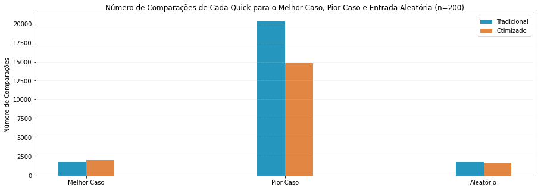

# EFC1 GCC253 - Complexidade e Projeto de Algoritmos

> **Prof.: Douglas H. S. Abreu**

**Aluna**: Joicy Paula dos Reis

**Matricula**: 201920347

**Turma**: 10A, 14A

Link do repositório GitHub: https://github.com/joicyreis/EFC1

● O trabalho deve ser feito em grupos de no máximo 2 componentes (todos devem enviar a atividade no Campus Virtual)

● Trabalhos entregues após a data limite não serão aceitos

● Data limite de entrega: 24 de Julho de 2022 : 23h55m

● Enviar o trabalho para o campus virtual, do seguinte modo: link do repositório GitHub e do Colab para acesso ao Notebook. A Documentação deve estar no readme

● O trabalho deve ser desenvolvido no modelo Notebook utilizando a linguagem Python

# Funções Auxiliares

Funções que geram arrays, contam o tempo de executação e auxiliam de forma geral a atividade.

## Função de Análise

Auxilia na contagem do tempo de execução do algoritmo que for informado complementando o número de comparações realizadas (cada algoritmo implementa as comparações de forma individual).

Retorna uma tupla contendo o número de comparações que o algoritmo realizou com o arry indicado e o tempo de execução.

## Função Swap (Troca)

Função para auxiliar na dinâmica de troca dentro de um array.

## Funções de Geração de Array

Estas funções auxiliam na criação de arrays para satisfazer as questões da atividade (arrays aleatórios e/ou ordenados).

# Questões

1.   Dado um conjunto de arranjos ***A[5,...,1000, passo=5]***

> a) Defina o melhor e pior caso para cada um dos algoritmos definidos acima, crie vetores ***A*** para estes casos e faça a comparação gráficamente também com casos aleatórios (plote um gráfico para cada algoritmo). Conte o numero de comparações realzizadas para cada uma das execuções.

> b) Repita o procedimento acima. Porém compare os algoritmos para pior e melhor caso e também casos aleatórios.

> c) Qual é o comportamento assintótico para cada um dos algorítmos acima (melhor caso e pior caso, se puder, analise também em casos aleatórios)

2.   Desenvolda uma versão aleatorizada do QUICKSORT (pivo aleatório) e compare com a versão apresentada em sala de aula e definida acima.

**Obs.:** para os algoritmos QuickSort e Merge Sort mostre apenas um melhor e um pior caso. faça a comparação com os demais métodos com o conjunto ***A*** apenas em casos aleatórios.

---
---

## Respostas

**Análise de melhor e pior caso geral para os algoritmos acima com suas complexidades:**

| Algoritmo | Melhor Caso | $\Omega$ | Pior Caso | $O$ | Caso Médio | $\theta$ |
|---|---|:---:|---|:---:|----|:---:|
|Insertion Sort|Array já se encontra ordenado|$O(n)$|Array está inversamente ordenado|$O(n^2)$| Array possui seus valores aleatoriamente distribuídos | $O(n^2)$ |
|Merge Sort|-|$O(n\log n)$|-|$O(n\log n)$| - | $O(n \log n)$ |
|Selection Sort|Array já se encontra ordenado|$O(n^2)$|Array está inversamente ordenado|$O(n^2)$| Array possui seus valores aleatoriamente distribuídos | $O(n^2)$ |
|Bubble Sort|Array já se encontra ordenado|$O(n^2)$|Array está inversamente ordenado|$O(n^2)$| Array possui seus valores aleatoriamente distribuídos | $O(n^2)$ |
|Heap Sort|-|$O(n\log n)$|O array já se encontra ordenado|$O(n\log n)$| - | $O(n\log n)$ |
|Quick Sort|Pivô é sempre o valor intermediário (ou próximo dele)|$O(n\log n)$|Pivô é sempre o menor elemento ou o maior|$O(n^2)$| Pivô não é nem o intermediário, nem um dos extremos | $O(n\log n)$ |

**Comportamento Assintótico:**

| Algoritmo | Melhor Caso | Pior Caso | Caso Médio |
|---|---|---|---|
|Insertion Sort| Linear | Quadrático | Quadrático |
|Merge Sort| Linear Logarítmico| Linear Logarítmico| Linear Logarítmico|
|Selection Sort| Quadrático | Quadrático| Quadrático|
|Bubble Sort|Quadrático | Quadrático|Quadrático |
|Heap Sort| Linear Logarítmico|Linear Logarítmico |Linear Logarítmico |
|Quick Sort|Linear Logarítmico | Quadrático| Linear Logarítmico|

No caso do Merge Sort, para qualquer configuração do array ele fará o mesmo número de comparações com tempo de execução muito próximo um do outro. Isso se deve ao método de divisão e conquista que o Merge utiliza que no processo de merge sempre vai fazer $n$ comparações, onde $n = e + d$, para $e$ sendo o tamanho do array filho a esquerda e $d$ o tamanho do array filho a direita.

O Heap Sort sempre passa por uma etapa de construção do Heap ($O(n)$) e a ordenação é baseada em troca ($O(1)$) e ajuste de elementos ($O(n\log n)$) executadas $n-1$ vezes. Dessa forma para qualquer um dos casos a complexidade é $O(n\log n)$. Contudo, observou-se que quando o array já se encontra ordenado, há mais chamadas da função "heapfy" o que aumenta o número de comparações $-$ o que não altera a complexidade denotada.

### Gráficos

Três arrays foram criados (um para o melhor caso, um para o pior e um aleatório), como o especificado, para cada algoritmo de ordenação, todos com tamanho ($n$) igual a 200.

O resultado para o tempo de execução dos algoritmos:

O resultado para o número de comparações feitas:

Como pode ser observado, em todos os casos o Bubble Sort original (nenhuma otimização) é o que teve o pior desempenho. O Merge Sort foi o com melhor resultado geral. Para o melhor caso e caso aleatório o Quick Sort teve melhor desempenho que o Merge, porém perde muito no pior caso ficando muito próximo do Select e do Insertion Sorts.

### Comparação de Algoritmos Quick Sort

Como solicitado pela questão 2, foi desenvolvido um Quick Sort de pivô aleatorizado. Ao compará-lo com os resultados obtidos do Quick Sort tradicional têm-se o seguinte:

O resultado para o número de comparações feitas:

Como pode ser observado, o Quick Sort aleatorizado é levemente pior que o tradicional em casos aleatórios. Contudo, ele ganha uma boa vantagem no pior caso.

>**Importante**: Os valores apresentados nos gráficos em relação ao tempo de execução podem ficar diferentes de acordo com o ambiente em que o código for executado. Para os casos aleatórios isso acontecerá ainda mais pela questão de que não se tem controle sobre a ordem dos elementos nesses arrays.
